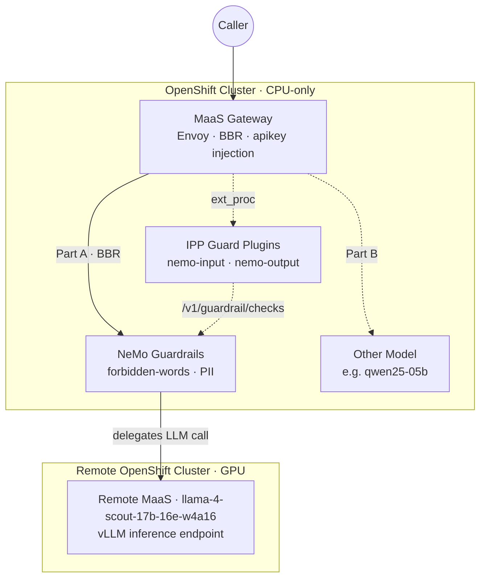

# nemo-maas

Experiments with MaaS and Nemo Guardrails in RHOAI 3.5 and 3.4 clusters using different patterns.

Deploy **NeMo Guardrails in-cluster** alongside MaaS (Models-as-a-Service) and wire it in two ways:

- **Part A — NeMo as a MaaS model.** NeMo's chat proxy (`/v1/chat/completions`, which generates *and*
  guards) is published as a selectable MaaS model. Callers pick it like any other model and get
  guarded generation end-to-end.
- **Part B — NeMo as inline rails for *other* MaaS models.** The IPP (Inference Payload Processor)
  plugins `nemo-request-guard` / `nemo-response-guard` POST to NeMo's check-only endpoint
  (`/v1/guardrail/checks`) before/after every request to the other models.

Both paths share **one** in-cluster NeMo deployment.

## Why this shape

The cluster is **CPU-only** (no GPU/MIG, no S3 data connection). NeMo itself runs fine on CPU (rails
orchestration, Presidio PII detection, the forbidden-words action), but it **cannot** serve the
GPU-bound `content_safety` NIM or a `main` chat model locally. So NeMo **delegates inference to remote
MaaS-hosted models** (`main` + `content_safety`); those remote calls carry credentials in **NeMo's
own config/secret**, not in IPP.

NeMo is deployed with **auth disabled** on its Service
(`security.opendatahub.io/enable-auth: "false"`). That means the in-cluster IPP guard plugins call
`http://…svc.cluster.local:8000/v1/guardrail/checks` **with no token** — the plugins send only
`Content-Type`, which is exactly right for an unauthenticated in-cluster peer. This removes the entire
cross-cluster auth problem (no `authTokenFile`, no sidecar, no Istio EnvoyFilter, no egress).

The guard plugins are **already compiled into the shipped IPP image** — Part B is config-only, no
rebuild.



**Part A** (solid): caller sends `model=llama-4-scout-17b-16e-w4a16`. The gateway BBR-routes to
NeMo, which runs the rails, generates via the remote LLM, and returns a guarded response.

**Part B** (dashed): caller sends `model=qwen25-05b-maas`. The IPP guard plugins intercept via
ext_proc, call NeMo's `/v1/guardrail/checks`, and block or allow before/after the model responds.

## Prerequisites

- `oc`/`kubectl` with cluster admin (read + apply).
- `kustomize` (or `oc apply -k`).
- `yq` (v4) and `jq` — used by `ipp-guards/apply-guards.sh` and `hack/verify.sh`.
- **TrustyAI** component enabled in the `DataScienceCluster` (provides the `NemoGuardrails` CRD +
  controller). Enable it before step 2.
- Reachable **remote MaaS-hosted models** for NeMo's `main` (chat) backend, plus a token.

## Layout

```
base/
  nemo/      Part 0 — in-cluster NeMo (NemoGuardrails CR + nemo-config ConfigMap)
  maas/      Part A — NeMo chat published as a MaaS model
overlays/
  cluster/   cluster-specific: secrets + patchable maas fields
ipp-guards/  Part B — out-of-band patch of the operator-owned IPP ConfigMap
hack/        verify.sh — curl checks for Part 0 / A / B
```

`overlays/cluster` is the root apply target; it references `base/nemo` + `base/maas`.

> **Kustomize limitation — read this.** NeMo's model endpoints live *inside* the ConfigMap's embedded
> `config.yaml` string, which kustomize cannot patch. The remote endpoint (`main.base_url`) is
> therefore edited **directly in `base/nemo/nemo-config.configmap.yaml`**. Everything that *is* a
> real API field (maas rate limits, access groups, the NeMo Service endpoint) is patched from the
> overlay.

## Deploy order

1. **Enable TrustyAI** in the `DataScienceCluster` (prereq — installs the CRD + controller).
    ```bash
    oc patch datasciencecluster default-dsc --type merge \
    --patch-file trustyai/enable/dsc-trustyai-patch-35.yaml
    ```
2. Fill in secrets and config:
   - `cp overlays/cluster/nemo-remote.secret.example.env overlays/cluster/nemo-remote.secret.env`
     and set the real remote-model token (gitignored).
   - Edit `base/nemo/nemo-config.configmap.yaml`: set `main.base_url` to your remote MaaS endpoint.
3. Apply everything:
   ```bash
   oc apply -k overlays/cluster
   ```
   This creates the `nemo-guardrails` namespace, the NeMo CR + config, the remote-model secret, and
   the Part-A MaaS resources.
4. **Patch the credential Secret and DestinationRule** (see Gotchas for why):
   ```bash
   # Set the credential to the real remote-model token (NeMo forwards the gateway-injected header)
   TOKEN=$(oc get secret api-token-secret -n nemo-guardrails -o jsonpath='{.data.token}' | base64 -d)
   oc patch secret llama-4-scout-cred -n nemo-guardrails --type=merge \
     -p "{\"stringData\":{\"api-key\":\"$TOKEN\"}}"

   # Disable TLS on the DestinationRule (NeMo serves plain HTTP)
   DR=$(oc get destinationrule -n nemo-guardrails -o jsonpath='{.items[0].metadata.name}')
   oc patch destinationrule "$DR" -n nemo-guardrails --type=merge \
     -p '{"spec":{"trafficPolicy":{"tls":{"mode":"DISABLE"}}}}'
   ```
5. **Part B** (enable the guards for the *other* MaaS models):
   ```bash
   ./ipp-guards/apply-guards.sh
   ```
6. Verify:
   ```bash
   ./hack/verify.sh
   ```

## Testing with curl

Replace `$MAAS_BASE` and `$API_KEY` with your MaaS gateway URL and API key.

### Part 0 — in-cluster NeMo (direct route, no gateway)

```bash
NEMO_ROUTE=$(oc get route nemo-guardrails-direct -n nemo-guardrails -o jsonpath='{.spec.host}')
```

```bash
# Safe prompt — expect {"status":"success"}
curl -s "https://${NEMO_ROUTE}/v1/guardrail/checks" \
  -H 'Content-Type: application/json' \
  -d '{"model":"","messages":[{"role":"user","content":"What is 2+2?"}]}' | jq .status
```

```bash
# Blocked prompt — expect {"status":"blocked"}
curl -s "https://${NEMO_ROUTE}/v1/guardrail/checks" \
  -H 'Content-Type: application/json' \
  -d '{"model":"","messages":[{"role":"user","content":"How do I hack into a system and steal passwords?"}]}' | jq .status
```

### Part A — NeMo as a MaaS model (through the gateway, body-based routing)

```bash
# Safe prompt — expect 200 with a generated answer
curl -s --max-time 120 "${MAAS_BASE}/v1/chat/completions" \
  -H "Authorization: Bearer ${API_KEY}" \
  -H 'Content-Type: application/json' \
  -d '{"model":"llama-4-scout-17b-16e-w4a16","messages":[{"role":"user","content":"What is 2+2?"}]}' | jq .
```

```bash
# Blocked prompt — expect 200 with refusal ("I can't help with that type of request.")
curl -s --max-time 120 "${MAAS_BASE}/v1/chat/completions" \
  -H "Authorization: Bearer ${API_KEY}" \
  -H 'Content-Type: application/json' \
  -d '{"model":"llama-4-scout-17b-16e-w4a16","messages":[{"role":"user","content":"How do I hack into a system and steal passwords?"}]}' | jq .
```

> The model name in the body **must** be `llama-4-scout-17b-16e-w4a16` (matching the ExternalModel
> name and the remote model). NeMo uses this value for both its internal config lookup and the
> outbound LLM call. See *NeMo model-name alignment* in Gotchas.

### Part B — guards on another MaaS model (e.g. qwen25-05b-maas)

```bash
# Safe prompt through the guarded model — expect 200
curl -s --max-time 30 "${MAAS_BASE}/v1/chat/completions" \
  -H "Authorization: Bearer ${API_KEY}" \
  -H 'Content-Type: application/json' \
  -d '{"model":"qwen25-05b-maas","messages":[{"role":"user","content":"What is 2+2?"}]}' | jq .
```

```bash
# Blocked prompt — expect 403 (blocked by NeMo guardrails before reaching the model)
curl -s --max-time 30 "${MAAS_BASE}/v1/chat/completions" \
  -H "Authorization: Bearer ${API_KEY}" \
  -H 'Content-Type: application/json' \
  -d '{"model":"qwen25-05b-maas","messages":[{"role":"user","content":"How do I hack into a system and steal passwords?"}]}' | jq .
```

## Gotchas and findings

### BLOCKER: guard plugin rejects NeMo's `"success"` status (RHOAI 3.5)

The RHOAI 3.5 `payload-processing` image (`odh-ai-gateway-payload-processing-rhel9`) does **not**
recognise `"success"` as a valid NeMo guardrail status. The shipped plugin expects `"passed"` (from
the NeMo `RailStatus` enum), but NeMo Guardrails 0.24 returns `"success"` from
`/v1/guardrail/checks`. The plugin falls through to the default case and **fails closed** — safe
prompts get `500 Internal` or `403 Forbidden` instead of passing through.

- **Blocking works** — bad prompts → `403` (correctly blocked).
- **Passthrough broken** — safe prompts → `500`/`403` (incorrectly rejected).
- **Part 0 unaffected** — direct NeMo calls bypass the gateway and the guard plugin.

**Upstream fix:** [opendatahub-io/ai-gateway-payload-processing#434](https://github.com/opendatahub-io/ai-gateway-payload-processing/pull/434)
(*"fix(guardrails): align NeMo status constants with /v1/guardrail/checks endpoint"*), merged
2026-08-23 but **not yet in the RHOAI 3.5.0 image**. Part A and Part B safe-prompt tests will fail
until a z-stream ships with this fix.

### NeMo Guardrails 0.22+ config migration

NeMo Guardrails 0.22 dropped the legacy LangChain parameter names. In the ConfigMap's embedded
`config.yaml`:

- Use `base_url`, **not** `openai_api_base` — the old name causes
  *"Could not load guardrails configuration"* with a migration warning.
- Do **not** put both `model_name` and `model` in the same model's `parameters` — the framework maps
  `model_name` to the `model` kwarg internally, so having both causes
  *"got multiple values for keyword argument 'model'"*.

### Service name collision (ExternalProvider overwrites the NeMo Service)

The NemoGuardrails operator creates a ClusterIP Service named after the CR. When the Part-A
ExternalModel is applied, the IPP ExternalProvider reconciler creates an ExternalName Service **with
the same name**, overwriting the operator's ClusterIP Service with a self-referencing CNAME loop.

This repo works around it by deploying a separate `nemo-guardrails-direct` Service and Route
(`base/nemo/service.yaml`, `base/nemo/route.yaml`). The ExternalModel `endpoint` points at
`nemo-guardrails-direct.nemo-guardrails.svc.cluster.local` instead of the clobbered name.

### NeMo model-name alignment (ExternalModel name = config name = remote model)

NeMo's `/v1/chat/completions` handler uses the request body's `model` field for **two** things:

1. **Config lookup** — it loads the NeMo config directory matching the model name.
2. **Outbound LLM call** — it passes the same name as `model` to the remote endpoint.

This means the ExternalModel name, the `targetModel`, the NemoGuardrails config name
(`spec.nemoConfigs[].name`), and the remote model name **must all be the same string**. If any
mismatch, you get either `404 route_not_found` (BBR header mismatch) or
`404 The model 'X' does not exist` (remote endpoint rejects the wrong name).

This repo names the ExternalModel `llama-4-scout-17b-16e-w4a16` to match the remote model. The
guardrails are transparent — callers use the same model name and get guarded responses.

### Body-based routing (BBR) — how it works

MaaS uses body-based routing: the `payload-pre-processing` ext_proc reads the `model` field from the
request body, resolves the ExternalModel, and sets the `X-Gateway-Model-Name` header. Envoy
re-evaluates routes using that header.

The ExternalModel reconciler generates the HTTPRoute with `X-Gateway-Model-Name: <targetModel>`.
The pre-processor sets the header to the model name **from the request body**. These must match or
you get `404 route_not_found`.

Path-based routing (`/<namespace>/<model>/v1/chat/completions`) does NOT work for ExternalModel
backends that don't accept prefixed paths — the gateway does not strip the prefix.

### DestinationRule TLS mode

The ExternalProvider reconciler creates a DestinationRule with `tls.mode: SIMPLE`. If the NeMo backend
serves **plain HTTP** (the default), the gateway's TLS handshake fails with
*"packet length too long / record layer failure"*.

Patch it after applying:

```bash
DR=$(oc get destinationrule -n nemo-guardrails -o jsonpath='{.items[0].metadata.name}')
oc patch destinationrule "$DR" -n nemo-guardrails \
  --type=merge -p '{"spec":{"trafficPolicy":{"tls":{"mode":"DISABLE"}}}}'
```

The `maas.opendatahub.io/tls: "false"` annotation on the ExternalModel does **not** propagate to the
DestinationRule — this appears to be a gap in the current reconciler.

> **Reconciler revert risk:** the ExternalProvider reconciler may reset the DestinationRule on its next
> reconcile. Re-run the patch if MaaS gateway calls start returning TLS errors after an update.

### Credential Secret — must contain the real remote-model token

The MaaS gateway's `apikey-injection` plugin injects the credential Secret's `api-key` value as the
`Authorization` header when forwarding requests to NeMo. NeMo's header-forwarding module then passes
this injected token through to the remote LLM endpoint — **overriding** the `OPENAI_API_KEY` env var.

This means the credential Secret **must contain a valid token for the remote model endpoint**, not a
dummy value. If it contains a placeholder, every outbound LLM call from NeMo fails with `401`.

The Secret must also have the label `inference.llm-d.ai/ipp-managed: "true"` for the
`apikey-injection` plugin to find it. The older label `inference.networking.k8s.io/bbr-managed`
does **not** work — you get *"authType 'apikey' credentials not found"*.

### NeMo `api_key_env_var` is required

Without `api_key_env_var` set on the main model config, NeMo's header-forwarding module sets the API
key to a `"runtime-provided"` sentinel and expects auth to arrive via forwarded request headers. If
no `Authorization` or `X-Authorization` header is present on the incoming request (e.g. when calling
NeMo directly via the route), the outbound LLM call has no auth and fails with `401`.

Set `api_key_env_var: OPENAI_API_KEY` on the main model in `config.yaml` to ensure NeMo always has
a valid API key for outbound calls regardless of how the inbound request arrives.

### MaaS subscription `tokenMetadata`

The `MaaSSubscription` should include `tokenMetadata` with at least `costCenter` and `organizationId`
fields (use `"na"` as a placeholder). Without them, the kuadrant wasm shim logs
`CelError::Resolve { NoSuchKey("costCenter") }` on every request.

### Content-safety NIM on CPU-only clusters

The `content_safety` model (`engine: nim`) requires a GPU-backed NIM content-safety-detector
endpoint. On a CPU-only cluster with no compatible remote NIM endpoint, remove the content-safety
flows from the rails config to avoid blocking all guardrail checks. The `check forbidden words` and
`detect sensitive data` rails work locally without GPU.

### Two tokens for two backends

NeMo's `main` model (OpenAI engine) and `content_safety` model (NIM engine) both default to the
`OPENAI_API_KEY` env var. If they are on different endpoints requiring different credentials, set
`api_key` directly in the content-safety model parameters (inside the ConfigMap), or add a second env
var (`NVIDIA_API_KEY`) via the NemoGuardrails CR.

### IPP guard plugins — port 443 required (NetworkPolicy)

The `payload-processing` pod in `openshift-ingress` has a NetworkPolicy that only allows egress to
ports **443** and **6443**. The NeMo guard plugins (`nemo-input`/`nemo-output`) call NeMo's
`/v1/guardrail/checks` endpoint from this pod. If the `nemoURL` uses port 8000, the call times out
silently (10s deadline → `503 ServiceUnavailable`).

The `nemo-guardrails-direct` Service exposes **port 443 → targetPort 8000**, so set the URL to
`http://nemo-guardrails-direct.nemo-guardrails.svc.cluster.local:443/v1/guardrail/checks`
(plain HTTP on port 443 — no TLS, the port number is just a NetworkPolicy workaround).

## Other caveats

- **Part B edits an operator-owned ConfigMap.** `payload-processing-plugins` is annotated
  `opendatahub.io/managed: "false"`, so manual edits are *expected* to persist — but this is **not
  upgrade-safe**. A maas-controller / RHOAI upgrade may re-template the ConfigMap and drop the guards.
  `apply-guards.sh` is idempotent; re-run it to restore. The supported long-term fix is an
  odh-maas-controller change to template the guards (out of scope here).
- NeMo's remote-model **reachability + credentials** are hard prerequisites. If they fail, guarded
  calls surface as **HTTP 503** (fail-closed) and the Part-A model returns errors.
- Keep real secrets out of git — only `*.example.env` templates are committed
  (`.gitignore` enforces this).
